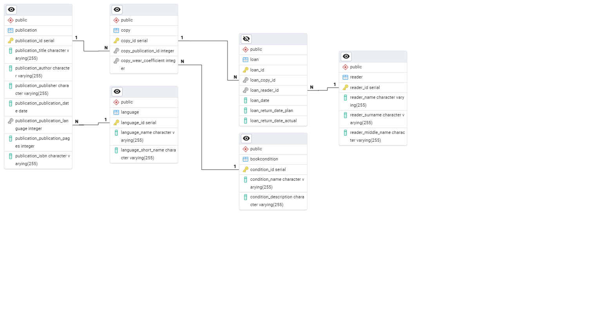

# Отчет по базе данных

### Скрипт создания базы находится в postgres/initdb/init.sql.back

## Описание БД

База данных была спроектирована для хранения информации о книгах, читателях и выдаче книг. В БД используются следующие таблицы:

- Language - языки
- Publication - издания
- Copy - экземпляры книг
- Reader - читатели
- Loan - выдача книг

## Описание таблиц

### Language

Таблица Language содержит информацию о языках. В таблице Language есть следующие столбцы:

- language_id - идентификатор языка (primary key)
- language_name - наименование языка
- language_short_name - краткое наименование языка

### Publication

Таблица Publication содержит информацию об изданиях. В таблице Publication есть следующие столбцы:

- publication_id - идентификатор издания (primary key)
- publication_title - наименование издания
- publication_author - автор
- publication_publisher - издатель
- publication_publication_date - дата издания
- publication_publication_language - язык издания (foreign key to Language)
- publication_publication_pages - количество страниц
- publication_ISBN - ISBN

### Copy

Таблица Copy содержит информацию об экземплярах книг. В таблице Copy есть следующие столбцы:

- copy_id - идентификатор экземпляра (primary key)
- copy_publication_id - идентификатор издания (foreign key to Publication)
- copy_wear_coefficient - коэффициент износа (foreign key to BookCondition)

### Reader

Таблица Reader содержит информацию о читателях. В таблице Reader есть следующие столбцы:

- reader_id - идентификатор читателя (primary key)
- reader_name - имя читателя
- reader_surname - фамилия читателя
- reader_middle_name - отчество читателя

### Loan

Таблица Loan содержит информацию о выдаче книг. В таблице Loan есть следующие столбцы:

- loan_id - идентификатор выдачи (primary key)
- loan_copy_id - идентификатор экземпляра (foreign key to Copy)
- loan_reader_id - идентификатор читателя (foreign key to Reader)
- loan_date - дата выдачи
- loan_return_date_plan - планируемая дата возврата
- loan_return_date_actual - фактическая дата возврата

## Описание relationship

### Publication - Copy

- publication_id (Publication) -> copy_publication_id (Copy) - Relationship one to many. One publication can have many copies.

### Copy - Loan

- copy_id (Copy) -> loan_copy_id (Loan) - Relationship one to many. One copy can have many loans.

### Reader - Loan

- reader_id (Reader) -> loan_reader_id (Loan) - Relationship one to many. One reader can have many loans.

### Publication - Language

- publication_publication_language (Publication) -> language_id (Language) - Relationship many to one. Many publications can have one language.

### Copy - BookCondition

- copy_wear_coefficient (Copy) -> condition_id (BookCondition) - Relationship many to one. Many copies can have one state.

# Связи таблицы
